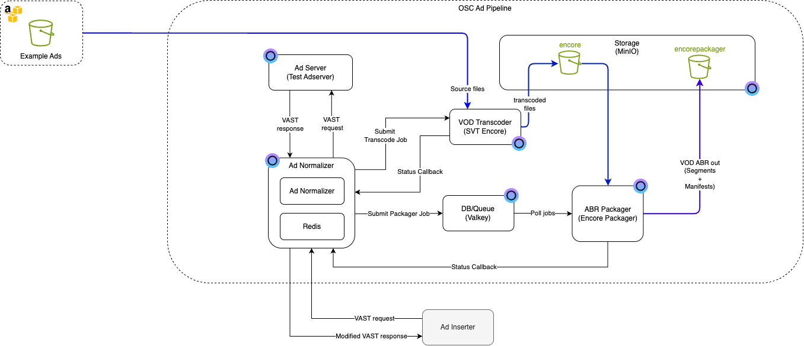

## Terraform/OpenTofu Example - Ad Pipeline Solution

This solution will automatically create a complete Ad pipeline using the following OSC components

- MinIO (S3 compatible storage)
- Valkey (Redis compatible key/value store used for encore packager job message queue)
- Encore (VOD transcoding system)
- Encore Packager (Packages the transcoded files to ABR-packages)
- Test Adserver (Generation of VAST/VMAP responses with example data and example ad assets)
- Ad Normalizer (Proxy between an Adstitcher and the Test Adserver. Orchastrates automatic transcoding and packaging of ad assets)

<a href="Ad-pipeline_diagram.png"></a>

See general guidelines [here](../../README.md#quick-guide---general)

### Solution variables

- Env variables that needs to be set

```bash
export TF_VAR_osc_pat = <osc personal access token>
export TF_VAR_minio_username = <User name for the minio storage>
export TF_VAR_minio_password = <Password for the minio storage>
export TF_VAR_valkey_password = <Password for the Valkey store>
```

### AWS CLI

! Note that the AWS CLI has to be installed since the terraform deployment takes care of creating the buckets automatically

For installing, please see: [here](https://docs.aws.amazon.com/cli/latest/userguide/cli-chap-getting-started.html)

Note!! - S3 CLI Env Var `AWS_ACCESS_KEY_ID` and `AWS_SECRET_ACCESS_KEY` must match `minio_username` and `minio_password`

### Using

Send an ad request to the ad-normalizer

```bash
curl -v -H 'accept: application/xml' "<adnormalizer_instance_url>/api/v1/vast?dur=30"
```

where <adnormalizer_instance_url> is the URL to the Ad Normalizer instance created.

Example:

```bash
curl -v -H 'accept: application/xml' "https://yourtenantname-myadpipeline.eyevinn-ad-normalizer.auto.prod.osaas.io/api/v1/vast?dur=30"
```

The first time this request is done, the Ad Normalizer will respond with an empty VAST response since there are no ad assets ready for streaming. The Ad Normlizer will now trigger Encore and Encore Packager to transcode and package the ads for streaming. This process will typically take a few minutes to complete. If the same request is then sent again, the response should contain proper VAST data.
