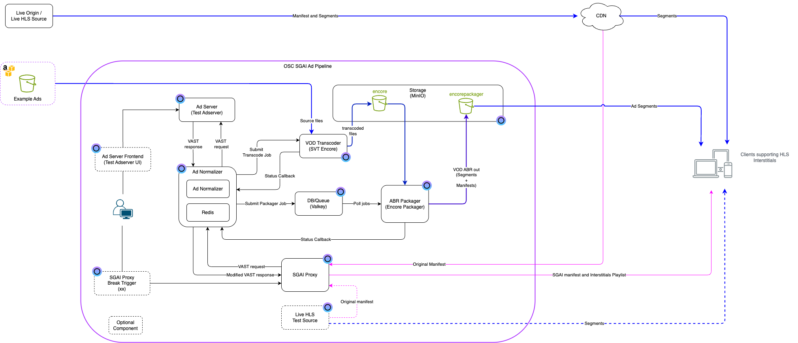

## Terraform/OpenTofu Example - SGAI Pipeline Solution

This solution will automatically create a complete SGAI pipeline using the following OSC components

- MinIO (S3 compatible storage)
- Valkey (Redis compatible key/value store used for encore packager job message queue)
- Encore (VOD transcoding system)
- Encore Packager (Packages the transcoded files to ABR-packages)
- Test Adserver (Generation of VAST/VMAP responses with example data and example ad assets)
- Ad Normalizer (Proxy between an Adstitcher and the Test Adserver. Orchestrates automatic transcoding and packaging of ad assets)
- SGAI Proxy (Proxy to insert ad-breaks as interstitials)
- Live HLS Test Source (Optional)
- Test AdServer UI (Optional)
- SGAI Proxy break trigger UI (TBD)(Optional)

<a href="sgai_pipeline_diagram.png"></a>

See general guidelines [here](../../README.md#quick-guide---general)

### Solution variables

Env variables that needs to be set (or via a .tfvars-file)

```bash
export TF_VAR_osc_pat = <osc personal access token>
export TF_VAR_minio_username = <User name for the minio storage>
export TF_VAR_minio_password = <Password for the minio storage>

```

### AWS CLI

! Note that the AWS CLI has to be installed since the terraform deployment takes care of creating the buckets automatically and also setting public download permissions for ads

For installing, please see: [here](https://docs.aws.amazon.com/cli/latest/userguide/cli-chap-getting-started.html)

Note!! - S3 CLI Env Var `AWS_ACCESS_KEY_ID` and `AWS_SECRET_ACCESS_KEY` must match `minio_username` and `minio_password`

### Using

#### Playback

Start playback of the live stream by using a player that supports interstitials, e.g. [hls js](https://hlsjs.video-dev.org/demo/) or the QuickTime Player on Mac

The URL to the proxied stream will be the same as the original source stream but where the original host has been replaced with the host of the SGAI Ad Proxy.

Example:

Lets assume the original source stream URI is:

`https://some.host.com/loop/master.m3u8`

then the proxied URL will be:

`https://yourtenantname-mysgaipipeline.eyevinn-sgai-ad-proxy.auto.prod.osaas.io/loop/master.m3u8`

#### Trigger an ad break

If Insertion Mode is set to dynamic. Trigger an ad-break using the provided UI or manually by sending a `command` request to the SGAI Proxy

```bash
curl "<sgai_adproxy_instance_url>/command?in=5&dur=10&pod=2"
```

where <sgai_adproxy_instance_url> is the URL to the SGAI Ad proxy instance created.

Example:

```bash
curl "https://yourtenantname-mysgaipipeline.eyevinn-sgai-ad-proxy.auto.prod.osaas.io/command?in=5&dur=10&pod=2"
```

This will insert an ad break at 5 seconds from the live-edge with a duration of 10 seconds and 2 creatives.

#### Note

The first time this request is done, the Ad Normalizer will respond with an empty VAST response since there are no ad assets ready for streaming. The Ad Normlizer will now trigger Encore and Encore Packager to transcode and package the ads for streaming. This process will typically take a few minutes to complete. If the same request is then sent again, the response should contain proper VAST data and the SGAI Ad proxy should ad interstitials for the ad-break.
